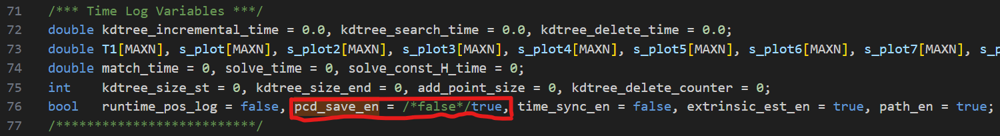
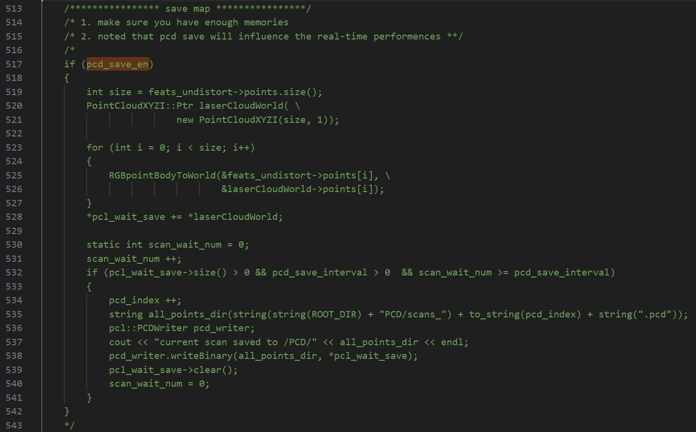
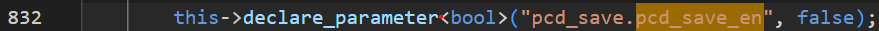

# Use Livox MID360 & Fastlio SLAM
- **Installation**  
This setup is tested on Ubuntu 22.04 and ROS2 humble. For general installtion guidance, we can follow [this link](https://www.cnblogs.com/oliudaneng/p/18964156). The "save_map" function should be activated through some files changes. I will update this later.
- **Open "save map" function after SLAM**
  * Change the value of the variables to enable "save map"
    * Around Line 76 in "LaserMapping.cpp", pcd_save_en -> true
    
    * Un-comment Line 513-543
    
    * Around Line 832, pcd_save.pcd_save_en -> true
    
